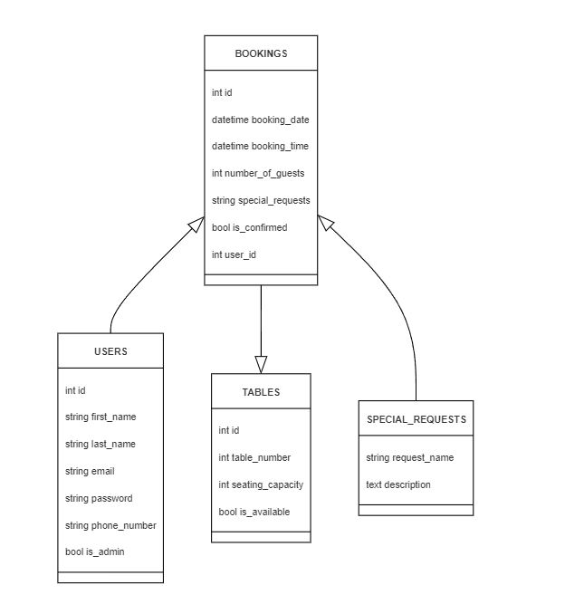

# Mythos greek dining

Welcome to Mythos greek dining, a delightful culinary destination that offers an authentic Greek dining experience. Our Django-based website provides an intuitive platform for exploring our delicious menu and making reservations. Whether you're planning a cozy dinner for two or a festive gathering, Mythos greek dining is the perfect place to savor traditional Greek dishes prepared with love and fresh ingredients.

[View Mythos greek dining live website here](https://mythos-dreek-dining-238998e2039b.herokuapp.com/)
- - - 

## Table of Contents
### [User Experience](#user-experience-ux)
* [Project Goals](#project-goals)
* [Agile Methodology](#agile-methodology)
* [Target Audience](#target-audience)
* [First-time user](#first-time-user)
* [Registered user](#registered-user)
* [Admin user](#admin-user)
### [Design](#design-1)
* [Website images](#Website-images)
* [Logo](#Logo)
* [Wireframes](#wireframes)
* [Data Model](#data-model)
* [User Journey](#user-journey)
* [Database Schema](#database-schema)
### [Security Features](#security-features-1)
### [Features](#features-1)
* [Existing Features](#existing-features)
* [Features Left to Implement](#features-left-to-implement)
### [Technologies Used](#technologies-used-1)
* [Languages Used](#languages-used)
* [Databases Used](#databases-used)
* [Frameworks Used](#frameworks-used)
* [Programs Used](#programs-used)
### [Deployment and Local Development](#deployment-and-local-development-1)
* [Local Development](#local-development)
* [Database Setup](#database-setup)
* [Heroku Deployment](#heroku-deployment)
### [Testing](#testing-1)
### [References](#references-1)
* [Docs](#docs)
* [Content](#content)
* [Acknowledgments](#acknowledgments)

---

## User Experience (UX)

Experience an inviting and user-friendly environment at Mythos greek dining. Our website offers simple navigation, appealing visuals, and an easy booking process. Users can browse the menu and make reservations seamlessly. The mobile-responsive design ensures that planning your visit is convenient from any device, enhancing your overall dining experience.

### Project Goals

The goal of the Mythos greek dining project is to create an accessible online platform that showcases our delicious Greek cuisine and allows visitors to make reservations effortlessly. The project focuses on delivering a user-centric experience with engaging visuals and straightforward functionality.

### Agile Methodology

Agile methodology was employed to manage tasks effectively, allowing for flexibility and continuous improvement. User stories were developed to define project requirements and guide the development process.

* Epics were outlined to capture broader features and functionalities of the website.
* User stories were created to focus on specific user needs, facilitating iterative development.
* A public project board was maintained to track task progress across various stages: Backlog, To Do, In Progress, Review/Testing and Done.

#### You can view the project board [here](https://trello.com/b/sXlEn8eC/mythos-greek-dining).

## User Stories

### Epics
- User Experience (UX)
- Design and Layout
- Booking System
- Custom User Model
- Automated Testing
- Deployment
- Bug Fixes

### User Stories
- Responsive Design
- Intuitive Navigation
- Booking Form
- User Authentication
- User Profile
- Test Validation and Forms
- Test Views and URLs
- Bug Fixes (Navbar Responsiveness, Error Handling in Booking Form)
- Future Features (User Reviews)

## Target Audience

* Diners seeking a comfortable and welcoming dining experience at a local restaurant.
* Food enthusiasts interested in exploring a variety of dishes made from fresh, high-quality ingredients.
* Individuals or groups looking for an easy and convenient table reservation system.
* Users who value a visually appealing and responsive website that works well on any device.
* Families or couples looking for a relaxed environment to enjoy a meal together.
* Visitors in the area who are looking for a restaurant with clear directions and location information.
* Event planners or groups looking to book a venue for special occasions or gatherings.

## First-time User

* Simple and intuitive navigation that makes it easy to explore the menu, check out restaurant details, and make reservations.
* Visually engaging content that showcases the restaurant's atmosphere and culinary offerings.
* Detailed information about the restaurant, including opening hours, location, and available services.
* A user-friendly booking form with clear instructions and validation to avoid mistakes during table reservation.
* Easy access to contact information for any inquiries or special requests.

## Registered User

* A seamless login process that allows registered users to quickly access their accounts.
* The ability to easily view and manage bookings directly from their personalized dashboard.
* Save profile details, including contact information for a faster and easier booking.
* Convenient features to modify or cancel existing reservations without hassle.

## Admin User

* A secure and dedicated admin login portal with access controls to ensure data privacy.
* A comprehensive dashboard for managing bookings, customer details, and table availability.
* Control over seating arrangements and table management to optimize bookings.
* Options to view, edit, or cancel customer reservations as needed.
* Access to user data for managing accounts and ensuring smooth customer experiences.
* Oversight of all restaurant operations through an easy-to-use interface, allowing the admin to focus on service quality and customer satisfaction.

## Design

### Website Images

All images were created using Artificial Inteligence, AI image generator.

### Logo

Logo was also created using AI image generator.

### Wireframes

Wireframes were created to outline the website's layout and user flow, ensuring a logical and user-friendly structure.

### Data Model

1. AllAuth CustomUser
    * Django Allauth, the User model is a customization of the default user model provided by the Django authentication system to remove the need of username and instead have the users email as the username.
    * The User entity has a one-to-many relationship with the Booking entity. This means that a User can have multiple Bookings, but each Booking is associated with only one User.
---
2. Admin Model
    * Data model created so admin can add Tables and change information, such as table number and size.
    * Only Admin can change the data in the backend.
    * User can book the tables through the Booking Model.
---
3. Booking Model
    * A User can have multiple Bookings, but each Booking is associated with only one User. This is represented by the foreign key relationship between User and Booking.
    * Booking model has a feature that prevents overlapping table bookings. So the smame table cant be book twiced at the same time, It has a time buffer of 1 hour.
    * Full CRUD functionality is available to the user.
    ---

### User Journey

### Database Schema

## Security Features

### User Authentication

* **Django Allauth** is a widely-used library for authentication and authorization in Django. It offers a comprehensive set of features for managing user registration, authentication, and account management.

### Login Decorator

* The views `booking_create`, `booking_success`, `manage_booking`, `edit_booking`, and `delete_booking` involve user booking operations and are protected by the `login_required` decorator. 
* This decorator ensures that only authenticated users have access to these views.

### CSRF Protection

* Django includes built-in safeguards against Cross-Site Request Forgery (CSRF) attacks. It generates CSRF tokens for each user session, which are required for submitting forms or executing state-changing actions. When a user logs out, the session and its associated CSRF token are invalidated, making it challenging for an attacker to forge a legitimate request using a copied URL.

### Form Validation

* The `booking_create` view handles form validation through the `BookingForm` class. It checks for various validation errors, including the number of guests, email and phone number formats, table availability, and whether the booking date and time fall within operating hours.

### Table Availability

* The `booking_create` view ensures table availability by checking several conditions related to the specified table. It retrieves the buffer times for the table and combines the booking date and time into a single `booking_datetime` object. 
* The view first verifies that the number of guests does not exceed the table's capacity. Then, it checks for any existing bookings that might conflict with the requested time, taking the buffer periods into account. If either of these conditions fails, a `ValidationError` is raised, preventing the booking from being confirmed.

## Features

* **Home Page**: 
  - Features a striking hero section with a compelling tagline and a prominent "Book a Table Now" button, encouraging immediate reservations.
  - Showcases three informative squares: 
    - **Our Food**: Highlights the restaurant's commitment to serving exquisite dishes made with care, accompanied by an invitation to explore the menu.
    - **Book a Table**: Offers a seamless reservation process for guests looking to enjoy a memorable dining experience.
    - **Where You Can Find Us**: Provides location details along with an embedded Google Map, ensuring guests can easily find the restaurant in the heart of the city.
  - Includes an "About Us" section that presents the restaurant's philosophy and dedication to exceptional service, enriching the user experience.
  
* **User Authentication**: Users can create an account and log in.

* **Booking Management**: 
  - When logged in, users gain access to create new bookings and manage their existing bookings.
  - Users have the ability to edit and delete their bookings as needed.

### Existing Features

* **Home Page**
    * Features a striking hero section with a compelling tagline and a prominent "Book a Table Now" button.
    * Displays three informative squares: Our Food, Book a Table, and Where You Can Find Us, along with an embedded Google Map for location details.

* **Logo**
    * The logo was created using an AI image generator, generating a unique logo based on descriptive keywords.

* **Navigation Bar**
    * Adapts depending on whether the user is a visitor, user, or admin.

    * **Visitor Navigation Bar**

    

    * **User Navigation Bar**

    

    * **Admin Navigation Bar**

    

* **Our Food Section**
    * Highlights the restaurant's commitment to quality cuisine with a welcoming description.

* **Book a Table Section**
    * Encourages users to make reservations with a seamless booking process.

* **Where You Can Find Us Section**
    * Provides location details and an embedded Google Map for easy navigation.

* **About Us Section**
    * Contains a short description of the restaurant's philosophy and dedication to exceptional service.

* **Footer**
    * Includes copyright information, social media links, and contact details for user convenience.

* **Contact Page**
    * Features fictional contact information, including an address and email, alongside social links.

* **Sign Up**
    * Allows users to create an account to access additional features.

* **Login**
    * Users can log into their accounts if they have previously created one.

* **Login flashcards**
    * Users get a confirmation that they have succefully logged in.

* **Manage Bookings**
    * Users can create, edit, and delete their bookings through a user-friendly interface.

* **Booking Form**
    * Users can fill out the booking form to reserve a table, with form validation ensuring correct submissions. Users are notified of any errors via alert messages.

* **Booking Successful Notification**
    * After a successful booking, users receive a confirmation message.

* **Edit Booking**
    * Users can modify their booking details and save the changes.

* **Delete Booking**
    * Users can delete their bookings, but confirmation is required before finalizing the deletion.

* **Log out**
    * Users can log out from their account, but confirmation is required before logging out.

* **Admin Features**
    * Django built-in admin panel allows admin control over the website.
    * Admin can access the admin panel through the navigation bar.
    * Can add, update, delete tables.
    * Change or cancel bookings.

* **Custom Error Pages**
    * 404 Error Page provides users with a button to redirect to the home page.
    * 500 Error Page provides users with a button to redirect to the home page.

### Features Left to Implement

- User reviews and ratings for dishes
- Loyalty rewards program
- Enhanced filtering options for the menu

## Technologies Used

### Languages Used

- HTML
- CSS
- JavaScript
- Python

### Databases Used

- PostgreSQL

### Frameworks Used

- Django
- Bootstrap 5.3

### Programs Used

- Gitpod for development
- Heroku for deployment
- PostgreSQL for database management
- Google fonts, Import main font the website
- Figma, Used to create wireframes and schemes

## Deployment and Local Development

Live deployment can be found on this [View Mythos greek dining live website here](https://mythos-dreek-dining-238998e2039b.herokuapp.com/)

### Local Development

#### How to Fork
1. Log in(or Sign Up) to Github
2. Go to repository for this project [Mythos greek dining](https://github.com/Vretinger/Mythos_Greek_Dining)
3. Click the fork button in the top right corner

#### How to Clone
1. Log in(or Sign Up) to Github
2. Go to repository for this project [Mythos greek dining](https://github.com/Vretinger/Mythos_Greek_Dining)
3. Click on the code button, select whether you would like to clone with HTTPS, SSH or GitHub CLI and copy the link shown.
4. Open the terminal in your code editor and change the current working directory to the location you want to use for the cloned directory.
5. Type the following command in the terminal (after the git clone you will need to paste the link you copied in step 3 above)
6. Set up a virtual environment (this step is not required if you are using the Code Institute Template in GitPod as this will already be set up for you).
7. Install the packages from the requirements.txt file - run Command pip3 install -r requirements.txtt

### Heroku Deployment
* Log into [Heroku](https://www.heroku.com/) account or create an account.
* Click the "New" button at the top right corner and select "Create New App".
* Enter a unique application name
* Select your region
* Click "Create App"

#### Heroku needs two additional files to deploy properly

* requirements.txt
* Procfile

#### Deploy

1. Make sure DEBUG = False in the settings.py
2. Go to the deploy tab on Heroku and connect to GitHub, then to the required repository.
3. Scroll to the bottom of the deploy page and either click Enable Automatic Deploys for automatic deploys or Deploy Branch to deploy manually. Manually deployed branches will need re-deploying each time the GitHub repository is updated.
4. Click 'Open App' to view the deployed live site.

Site is now live

## Testing
Please see  [TESTING.md](TESTING.md) for all the detailed testing performed.

## References
### Docs

* [Code Institute](https://learn.codeinstitute.net/dashboard)
* [Bootstrap 5.3](https://getbootstrap.com/docs/5.3/getting-started/introduction/)
* [Django docs](https://docs.djangoproject.com/en/4.2/releases/3.2/)
* [Django Allauth](https://django-allauth.readthedocs.io/en/latest/)
* [Django and Static Assets](https://devcenter.heroku.com/articles/django-assets)

### Content

* All of the content is imaginary and written by the developer, me, Hampus Vretinger.
* All images were generated with Artificial intelligence (AI) based on my word input and descriptions.
