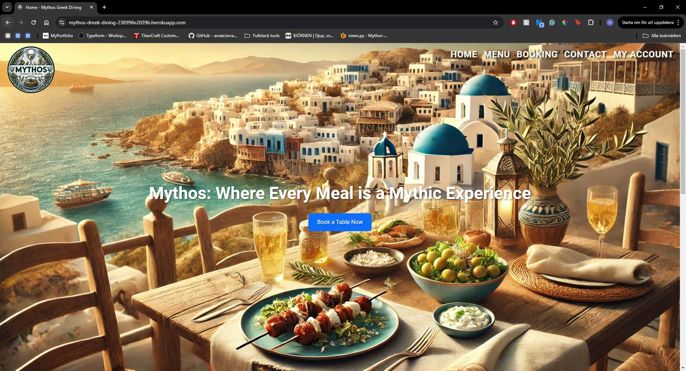
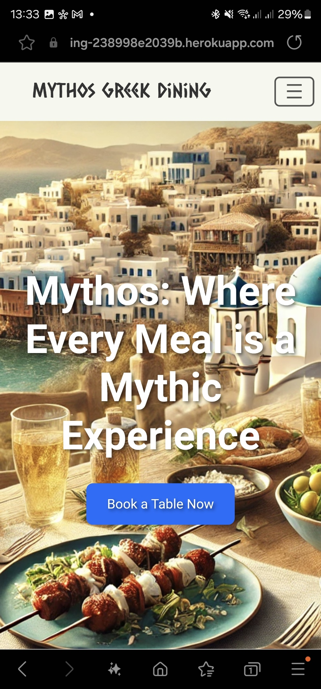
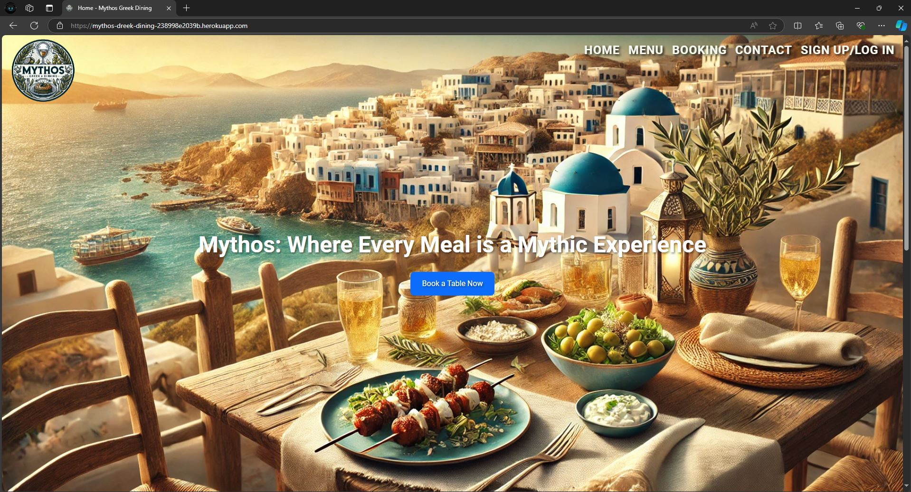
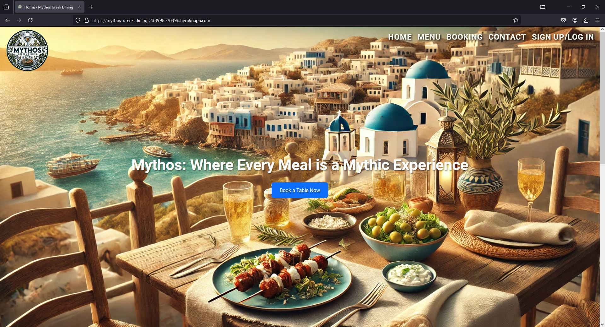
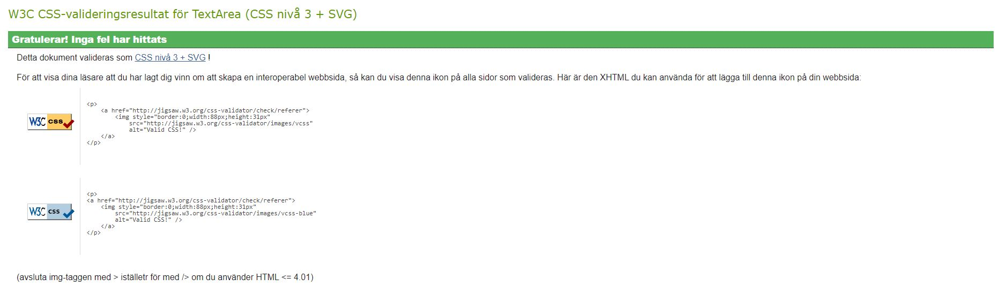

# Mythos Greek Dining | Testing

Return to [README](README.md)

- - -

Comprehensive testing has been performed to ensure the website's seamless and optimal functionality.

## Table of Contents
### [Responsiveness Testing](#responsiveness-testing)
### [Browser Compatibility Testing](#browser-compatibility-testing)
### [Device Testing](#device-testing)
### [Code Validation](#code-validation)
* [HTML Validation](#html-validation)
* [CSS Validation](#css-validation)
* [JavaScript Validation](#javascript-validation)
* [Python](#python)
### [Bugs](#bugs)
* [Resolved Bugs](#resolved-bugs)
* [Unresolved Bugs](#unresolved-bugs)
### [Automated Testing](#automated-testing)
### [Features Testing](#features-testing)
---

## Responsiveness Testing

The website was tested on multiple devices and screen sizes to ensure its responsiveness. Developer Tools were used to simulate various screen sizes, allowing for detailed checks on how the website behaves on different devices. Bootstrap classes and media queries were utilized to maintain a consistent design and functionality across platforms.

<details>
<summary> Desktop PC </summary>


</details>

<details>
<summary> Laptop </summary>


</details>

<details>
<summary> Tablet </summary>


</details>

<details>
<summary> Mobile </summary>


</details>

## Browser Compatibility Testing

The website was tested across multiple web browsers to check for compatibility issues. This ensures that the website provides a smooth and consistent experience regardless of the user's browser.

<details>
<summary> Chrome </summary>


</details>

<details>
<summary> Microsoft Edge </summary>


</details>

<details>
<summary> Firefox </summary>


</details>

<details>
  <summary>Samsung internet (Mobile)</summary>
  <div style="display: flex; gap: 10px;">
    
    
  </div>
</details>

## Device Testing

Device testing was carried out on a variety of devices, such as windows, iPhone and Samsung, to ensure proper functionality across different platforms.

## Code Validation

### HTML Validation

The HTML code was validated using the W3C Markup Validation Service. All HTML files were checked, and no errors were detected, confirming that the code is fully compliant with HTML standards.

### CSS Validation

<details>
<summary> Custom CSS (style.css)
</summary>


</details>

### JavaScript Validation

All JavaScript code was verified using JSHint. No errors or warnings were found during the validation process, ensuring that the JavaScript code follows best practices and is free from syntax issues.

### Python

Python code was validated using PEP8CI. While most code passed with no issues, there were some warnings related to line lengths exceeding the recommended limit. In these cases, where lines could not be shortened without affecting readability or functionality, the longer lines were retained.

## Bugs

### Resolved Bugs

- **Table Availability and Booking Validation in Django**
  - **Bug**: The booking system allowed overbooking of tables or did not properly validate table capacity, leading to double bookings or accepting more guests than a table could handle.
  - **Solution**: Improved the validation logic within the booking model to ensure no overlapping bookings occur. Added checks for table capacity and availability to ensure only valid bookings are allowed.

- **Navbar Layout Breaks on Smaller Screens**
  - **Bug**: The navbar layout broke on smaller screens, disrupting the user experience.
  - **Solution**: Adjusted the CSS with media queries to ensure proper responsiveness and implemented a more modern, sleek design using Bootstrap’s responsive classes.

- **Booking Form Error Messages Not Displaying**
  - **Bug**: Error messages on the booking form were not showing up when the form was invalid, leaving users without feedback.
  - **Solution**: Modified the form validation logic and updated the templates to properly display error messages for invalid fields.

- **Email and Phone Number Fields Not Saving in Booking Form**
  - **Bug**: The email and phone number fields were not saving correctly in the booking form, causing issues with user notifications.
  - **Solution**: Added the correct form fields and updated the model to ensure the data was saved correctly. Implemented phone number validation using `RegexValidator` to ensure proper formatting.

- **500 Server Error with Debugging**
  - **Bug**: The app encountered a 500 Internal Server Error when debugging was turned on, but no useful error messages were displayed when debugging was turned off.
  - **Solution**: Resolved by fixing database connection parameters and adjusting debugging settings in the Django configuration to properly handle and display error messages.

- **PostgreSQL Version Reverting in Gitpod**
  - **Bug**: PostgreSQL kept reverting to version 12 instead of version 14 in the Gitpod environment after restarts.
  - **Solution**: Updated the `gitpod.yml` file with the correct PostgreSQL version and startup configurations to ensure version 14 was consistently used.

- **Custom User Model and Email Login Issues**
  - **Bug**: Encountered issues when setting up a custom user model to allow login using email instead of a username.
  - **Solution**: Successfully implemented a custom user model and adjusted the authentication backend to support email-based login.

- **Deployment Errors on Heroku**
  - **Bug**: Various deployment issues on Heroku, including missing dependencies (`psycopg2`) and database connection problems.
  - **Solution**: Resolved by updating the `Procfile`, installing the necessary dependencies, and configuring environment variables for Heroku to properly connect to the PostgreSQL database.

- **Booking Date Validation for Past Dates**
  - **Bug**: The booking form allowed users to select past dates, leading to confusion and invalid bookings.
  - **Solution**: Added validation in the form to ensure that only future dates can be selected. Implemented an error message that alerts users when a past date is chosen.

### Unresolved Bugs
- None at this time.


## Automated Testing

Automated testing has been set up to ensure the stability and functionality of various aspects of the application, including models, forms, and views. The tests are written using Django's built-in `TestCase` framework and cover the following areas:

### Bookings App

1. **Model Testing**
   - **Booking Creation**: A test to verify that a booking can be created successfully, including fields such as guest name, email, phone number, booking date, time, number of guests, and table assignment.
   - **Table Capacity Validation**: This test ensures that a booking cannot be created if the number of guests exceeds the table's capacity. It raises a `ValidationError` when this condition is not met.

2. **Form Testing**
   - **Valid Booking Form Submission**: A test to confirm that a booking form is valid when all required fields are correctly filled.
   - **Invalid Email Validation**: A test case to check if the form properly handles invalid email addresses, ensuring the form submission is rejected with appropriate error messages.

3. **View Testing**
   - **Booking Creation View**: This test verifies that the booking form is correctly displayed when a user accesses the booking creation page via a GET request.
   - **Successful Booking Submission**: A test to ensure that valid booking data submitted via a POST request results in a redirect to the booking success page.
   - **Invalid Booking Submission (Past Date)**: This test checks if a booking with a past date is correctly handled, returning an error message indicating that the selected date and time have already passed.

### Contact App

1. **Form Testing**
   - **Valid Contact Form Submission**: A test that ensures the contact form is valid when all required fields (name, email, subject, message) are correctly filled.
   - **Invalid Contact Form Submission**: This test checks that the form is invalid when required fields, such as the name, are missing, ensuring proper error messages are displayed.

2. **View Testing**
   - **Contact Form GET Request**: A test to verify that the contact page is rendered correctly when accessed via a GET request.
   - **Successful Contact Form Submission**: A test case that ensures a valid contact form submission is processed correctly, resulting in a redirect and displaying a success message.
   - **Invalid Contact Form Submission**: This test checks if the form properly handles invalid data, ensuring the user is returned to the form with error messages and no data is saved.

### Menu App

1. **Menu Page Testing**
   - **Menu Page Load**: A test to ensure that the menu page loads correctly and returns a status code 200.
   - **Menu Items Displayed**: This test checks that specific menu items (e.g., `TZATZIKI`, `MOUSSAKA`, `BAKLAVA`) are correctly displayed on the menu page, ensuring that the correct template is used and that the menu items are rendered properly.

### Running the Tests

To run the automated tests, use the following command:

```bash
python manage.py test
```

## Features Testing
 
| Page                               | User Action                                       | Expected Result                                                  | Notes  |
|------------------------------------|---------------------------------------------------|------------------------------------------------------------------|--------|
| Home Page                          |                                                   |                                                                  |        |
|                                    | Click on Logo                                     | Redirect to Home Page                                            | PASS   |
|                                    | Click on login/Sign Up button                     | Redirect to Sign Up page                                         | PASS   |
|                                    | Click on Contact (Navigation bar)                 | Redirect to Contact page                                         | PASS   |
|                                    | Click on Booking (Navigation bar)                 | Redirect to booking page                                         | PASS   |
|                                    | Click on About (Footer)                           | Scroll to About section                                          | PASS   |
|                                    | Click on social media links in footer             | Opens new tab with correct social media page                     | PASS   |
| Home Page (Logged In - User)       |                                                   |                                                                  |        |
|                                    | After login                                       | Sign Up button is now My account button                          | PASS   |
|                                    | Click on Book Now                                 | Redirect to booking page                                         | PASS   |
|                                    | Click on My account (Navigation bar)              | Redirect to my account page                                      | PASS   |
| Home Page (Logged In - Admin)      |                                                   |                                                                  |        |
|                                    | Click on My account in dropdown                   | Redirect to my account page                                      | PASS   |
|                                    | Click on Admin Panel                              | Redirect to Django Admin Panel                                   | PASS   |
| Contact Page                       |                                                   |                                                                  |        |
|                                    | Click Submit with empty form                      | Shows error: "Please fill in all required fields"                | PASS   |
|                                    | Enter invalid email                               | Shows error: "Please enter a valid email address"                | PASS   |
|                                    | Leave a field empty                               | Shows error: "Please fill in all required fields"                | PASS   |
|                                    | Enter valid contact details                       | Contact successful, confirmation message                         | PASS   |
| Sign Up Page                       |                                                   |                                                                  |        |
|                                    | Enter invalid email                               | Shows error: "Please enter a valid email address"                | PASS   |
|                                    | Enter valid email                                 | No error, email accepted                                         | PASS   |
|                                    | Email field left empty                            | Error prompting to fill required fields                          | PASS   |
|                                    | Type invalid password                             | Must contain at least 8 characters                               | PASS   |
|                                    | Type valid password                               | No error                                                         | PASS   |
|                                    | Type mismatching passwords                        | Shows error: "Passwords must match"                              | PASS   |
|                                    | Click Sign Up with empty form                     | Error prompting to fill required fields                          | PASS   |
|                                    | Click logIn if already have an account            | Redirect to Login page                                           | PASS   |
|                                    | Fill all the form fields                          | Account created, success message shown                           | PASS   |
| Login Page                         |                                                   |                                                                  |        |
|                                    | Click on Sign Up if no account                    | Redirect to Sign Up page                                         | PASS   |
|                                    | Enter incorrect Email                             | Shows error: "Invalid email or password"                         | PASS   |
|                                    | Enter incorrect password                          | Shows error: "Invalid email or password"                         | PASS   |
|                                    | Enter valid email and password                    | Successful login and redirect                                    | PASS   |
|                                    | Click logIn with empty form                       | Error prompting to fill required fields                          | PASS   |
| Logout Page                        |                                                   |                                                                  |        |
|                                    | Click on Sign Out button                          | Logs user out and shows confirmation message                     | PASS   |
| Booking Page                       |                                                   |                                                                  |        |
|                                    | Click Book Now with empty form                    | Shows error: "Please fill in all required fields"                | PASS   |
|                                    | Try to select past booking date                   | Dates in the past are disabled                                   | PASS   |
|                                    | Try to select already booked date                 | Date is unavailable, disabled                                    | PASS   |
|                                    | Enter number of guests exceeding capacity         | Shows error: "Maximum guest capacity exceeded"                   | PASS   |
|                                    | Enter less than 1 guest                           | Shows error: "Minimum 1 guest required"                          | PASS   |
|                                    | Try to select a time outside opening hours        | Shows error: "Select a time inside opening hours 10:00-22:00"    | PASS   |
|                                    | Enter valid booking details                       | Booking successful, confirmation message                         | PASS   |
| Booking Overview Page              |                                                   |                                                                  |        |
|                                    | View bookings                                     | Displays correct bookings associated with the user               | PASS   |
|                                    | Click Edit on a booking                           | Redirects to Edit Booking page                                   | PASS   |
|                                    | Click Delete on a booking                         | Open Delete confirmation Modal                                   | PASS   |
| Edit Booking Page                  |                                                   |                                                                  |        |
|                                    | Try to select past booking date                   | Dates in the past are disabled                                   | PASS   |
|                                    | Try to select already booked date                 | Date is unavailable, disabled                                    | PASS   |
|                                    | Modify guest count beyond limit                   | Shows error: "Guest limit exceeded"                              | PASS   |
|                                    | Click Save Changes                                | Updates booking successfully and redirects                       | PASS   |
| Delete Booking Page                |                                                   |                                                                  |        |
|                                    | Confirm delete action                             | Deletes the booking and shows confirmation message               | PASS   |
|                                    | Cancel deletion                                   | Closes Confirmation modal                                        | PASS   |
| 404 Error Page                     |                                                   |                                                                  |        |
|                                    | Type in URL that does not exist                   | Displays custom 404 error page                                   | PASS   |
| 500 Error Page                     |                                                   |                                                                  |        |
|                                    | Trigger server error (local testing)              | Displays custom 500 error page                                   | PASS   |
| Admin Panel                        |                                                   |                                                                  |        |
|                                    | Access CRUD functionality for models              | Fully functional, allows admin to create, update, delete models  | PASS   |
|
